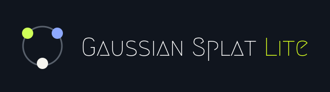

<div align="center">

# Gaussian-Splat-Lite

<p align="center">
  
</p>

</div>

`Gaussian-Splat-Lite` is a lightweight 3D Gaussian Splatting renderer for Three.js. It is based on the overall architecture of [SparkJS](https://github.com/sparkjsdev/spark), simplified and adapted to retain a stable, general-purpose Gaussian Splat rendering pipeline while removing LoD, paging, dynamic shader graphs, and broad format compatibility layers. It also fixes SparkJS precision issues with large GIS/ECEF world coordinates and provides faster depth sorting and raycasting implementations.

It works alongside standard Three.js scenes, cameras, meshes, and render loops, and supports unified generation, sorting, and blended rendering of multiple Splat objects.

## Features

- Native integration with the Three.js scene graph and rendering pipeline
- Multiple `SplatMesh` objects rendered with correct global sorting
- `.ply` and `.spz` file support
- URL, in-memory byte, and standard `ReadableStream` inputs
- Rust/WebAssembly file decoding, depth sorting, and raycasting
- 3DGS rendering and optional 2DGS support
- Spherical harmonics, depth of field, offscreen rendering, and environment-map rendering
- SDF-based color and opacity editing
- Camera-relative rendering for large GIS/ECEF world coordinates
- TypeScript declarations, ESM, and CommonJS builds

## Requirements

- A modern browser with WebGL2, WebAssembly, Web Workers, and ES modules
- Three.js `0.180.0` or newer
- Correct CORS headers when loading Splat files from another origin

## Installation

```sh
npm install gaussian-splat-lite three
```

## Quick start

```js
import * as THREE from "three";
import { GaussianSplatRenderer, SplatMesh } from "gaussian-splat-lite";

const scene = new THREE.Scene();
const camera = new THREE.PerspectiveCamera(
  60,
  window.innerWidth / window.innerHeight,
  0.1,
  1000,
);
camera.position.set(0, 0, 3);

const renderer = new THREE.WebGLRenderer({
  antialias: false,
  powerPreference: "high-performance",
});
renderer.setPixelRatio(window.devicePixelRatio);
renderer.setSize(window.innerWidth, window.innerHeight);
document.body.appendChild(renderer.domElement);

// One GaussianSplatRenderer is normally enough for each Three.js renderer.
const splatRenderer = new GaussianSplatRenderer({ renderer });
scene.add(splatRenderer);

const splat = new SplatMesh({ url: "/assets/scene.spz" });
scene.add(splat);

// Wait before reading loaded data such as the count or bounding box.
await splat.initialized;
console.log(`Loaded ${splat.numSplats} splats`);

renderer.setAnimationLoop(() => {
  renderer.render(scene, camera);
});

window.addEventListener("resize", () => {
  camera.aspect = window.innerWidth / window.innerHeight;
  camera.updateProjectionMatrix();
  renderer.setSize(window.innerWidth, window.innerHeight);
});
```

`GaussianSplatRenderer` is itself a Three.js scene object. It collects visible `SplatMesh` objects, generates GPU data, sorts the combined collection, and draws it. Application code continues to use the standard `renderer.render(scene, camera)` call; it does not need to issue a separate draw call for each Splat.

Some PLY/SPZ data uses a `+Y`-down, `+Z`-forward convention. If a model appears upside down or faces the wrong direction, rotate the object without changing its decoded data:

```js
splat.quaternion.set(1, 0, 0, 0); // Rotate 180 degrees around X.
```

## Loading data

### From a URL

```js
const splat = new SplatMesh({
  url: "/assets/model.ply", // .spz is also supported.
  onProgress: (event) => {
    if (event.lengthComputable) {
      console.log(`${Math.round((event.loaded / event.total) * 100)}%`);
    }
  },
  onLoad: (mesh) => console.log(mesh.numSplats),
});

scene.add(splat);
await splat.initialized;
```

### From a File or ReadableStream

This form is suitable for file pickers, drag and drop, and large local files. The data is decoded locally by WebAssembly and is not automatically uploaded anywhere.

```js
import { SplatFileType, SplatMesh } from "gaussian-splat-lite";

const file = fileInput.files[0];
const fileType = file.name.toLowerCase().endsWith(".spz")
  ? SplatFileType.SPZ
  : SplatFileType.PLY;

const splat = new SplatMesh({
  fileName: file.name,
  fileType,
  stream: file.stream(),
  streamLength: file.size,
  onProgress: ({ loaded, total }) => console.log(loaded, total),
});

scene.add(splat);
await splat.initialized;
```

Complete in-memory file data can also be supplied:

```js
const bytes = new Uint8Array(await file.arrayBuffer());
const splat = new SplatMesh({
  fileBytes: bytes,
  fileType: SplatFileType.SPZ,
});
```

When the input URL does not have a recognizable extension, specify `fileType` explicitly or provide a `.ply` / `.spz` name through `fileName`.

### Creating Splats in code

```js
import * as THREE from "three";
import { SplatMesh } from "gaussian-splat-lite";

const splat = new SplatMesh({
  maxSplats: 100,
  constructSplats: (data) => {
    data.pushSplat(
      new THREE.Vector3(0, 0, 0),       // center
      new THREE.Vector3(0.2, 0.1, 0.1), // scales
      new THREE.Quaternion(),            // rotation
      1,                                 // opacity
      new THREE.Color(0x4f8cff),         // color
    );
  },
});

scene.add(splat);
await splat.initialized;
```

## Core concepts and public API

| API | Purpose |
| --- | --- |
| [`GaussianSplatRenderer`](docs/GaussianSplatRenderer.md) | Integrates with Three.js and generates, sorts, and draws every visible Splat |
| [`SplatMesh`](docs/SplatMesh.md) | A transformable, visible, and raycastable Gaussian Splat scene object |
| [`SplatLoader`](docs/SplatLoader.md) | A Three.js Loader-style PLY/SPZ decoder |
| [`ExtSplats`](docs/ExtSplats.md) | The built-in high-precision Splat source, with per-Splat read and write access |
| [`SplatSource`](docs/SplatSource.md) | The TypeScript interface implemented by custom Splat sources |
| [`SplatEdit`](docs/SplatEdit.md) / [`SplatEditSdf`](docs/SplatEdit.md) | SDF-region RGBA editing objects |
| [`SplatAccumulator`](docs/SplatAccumulator.md) | A low-level generation buffer used by the renderer; normally internal |
| [`SplatFileType`](docs/SplatFileType.md) | File type enum containing `PLY` and `SPZ` |

## Large world coordinates / GIS / ECEF

The renderer keeps large translations separate from float32 local coordinates. Rendering subtracts the camera origin while values are still JavaScript double-precision numbers, and sorting stores one float64 world origin per `SplatMesh` alongside its float32 local centers. This happens automatically and does not move scene objects or change the world-coordinate behavior of `SplatMesh`, Raycaster, or SDF edits.

Source Splat centers should still remain local to their mesh wherever possible. Precision already lost by storing absolute ECEF coordinates in a float32 source cannot be recovered during rendering.

## Manual updates and animation

By default, the renderer automatically detects object-count, transform, appearance, and camera changes. Use `onFrame` for per-frame animation:

```js
const splat = new SplatMesh({
  url: "/assets/model.spz",
  onFrame: ({ mesh, time }) => {
    mesh.rotation.y = time * 0.2;
  },
});
```

When automatic updates are disabled, call `update()` after the scene or camera changes:

```js
const splatRenderer = new GaussianSplatRenderer({
  renderer,
  autoUpdate: false,
});

await splatRenderer.update({ scene, camera });
renderer.render(scene, camera);
```

## Offscreen rendering

```js
const captureRenderer = new GaussianSplatRenderer({
  renderer,
  target: {
    width: 1920,
    height: 1080,
    superXY: 2,
  },
});
scene.add(captureRenderer);

await captureRenderer.update({ scene, camera });
const rgba = await captureRenderer.renderReadTarget({ scene, camera });
// rgba is a 1920 * 1080 * 4 Uint8Array.
```

If the same scene also contains a `GaussianSplatRenderer` used for canvas display, control the instances with `layers` or `visible` as appropriate so that both are not rendered as ordinary scene objects during the same pass.

## Development

Building from source requires Node.js, a Rust toolchain installed through `rustup`, and the `wasm32-unknown-unknown` target. `build:wasm` installs `wasm-pack` through Cargo when it is not already available.

```sh
npm install
npm run build:wasm
npm run build
npm test
```

Start the local PLY/SPZ viewer with:

```sh
npm run dev
```

Open the local URL printed by Vite, normally `http://localhost:8080/`. Drag a `.ply` or `.spz` file onto the viewer, or use its file picker. Files are decoded locally and are not uploaded.

Other useful commands:

```sh
npm run build:watch
npm run lint
npm run format
```

The package build emits ESM and CommonJS bundles in `dist/`, together with TypeScript declarations and source maps.
